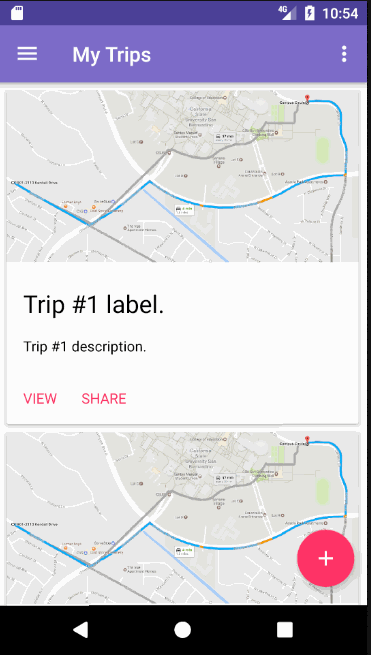
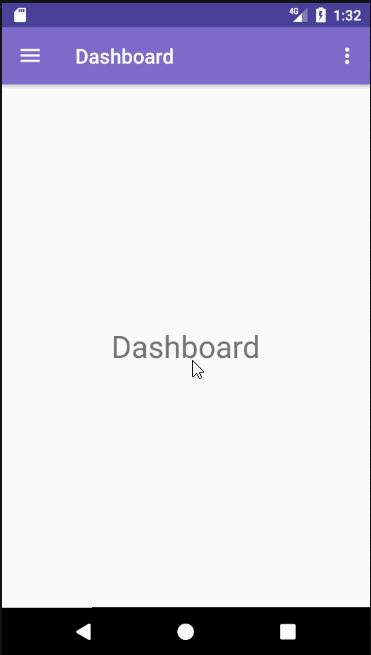

# Trip

An Android Application built with Google Map API, and Firebase Database. Trip mobile application allows users to notify others of their progress while traveling in terms of time, distance, and location.

## Documentations

* [Software Requirements Specification](https://docs.google.com/document/d/1rIw1KRA0GCMhkqSjjWDKs0Jc4icHCS5_4y0T0Lg6xLU/edit?usp=sharing)

* [Software Design Specification](https://docs.google.com/document/d/1s5fY7hZrAb6xYUP6Pb-6SqhTBxJR6YqiZMKsJzKE3ms/edit?usp=sharing)

* [Software Test Plan](https://docs.google.com/document/d/1N-ItdiJ6Mm0Uog_7YjrNFemHVGUoM7-xaXaer1_-_zU/edit?usp=sharing)

* [Test Plan Result](https://docs.google.com/document/d/11_sf98HyYTf1AalMmprh0el6SCuTTcgjvQjCdSHm4-U/edit?usp=sharing)

## Screenshots

## Download
[Trip Mobile](https://github.com/ichomchom/Trip-Mobile/releases/tag/1.0)

## Authors
* [Bogdan Kravtsov](https://github.com/bkboggy) - Project Manager

* [Huey Phan](https://github.com/ichomchom) - Lead Software Engineer

* [Brandon Bachman](https://github.com/masterbachman) - Design Architect

* [Juan Nevares](https://github.com/JuanNevares) - QA Engineer
